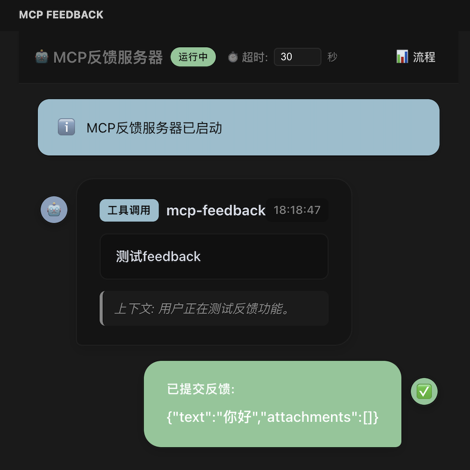

# mcp-feedback (VSCode Extension)

## 功能




## 安装

1. 在VSCode中按 `Ctrl+Shift+P` 或 `Cmd+Shift+P`
2. 输入 "Extensions: Install from VSIX..."
3. 选择 `.vsix` 文件安装

## 使用

1. 插件激活后，左侧出现 "mcp-feedback" 图标
2. 外部AI助手通过 `http://localhost:7423/mcp` 调用MCP工具
3. 用户在侧边栏输入反馈，结果返回给AI助手


## cursor配置文件

在 `.cursor/mcp.json` 添加：

```json
{
  "mcpServers": {
    "mcp-feedback": {
      "url": "http://localhost:7423/mcp"
    }
  }
}
```
